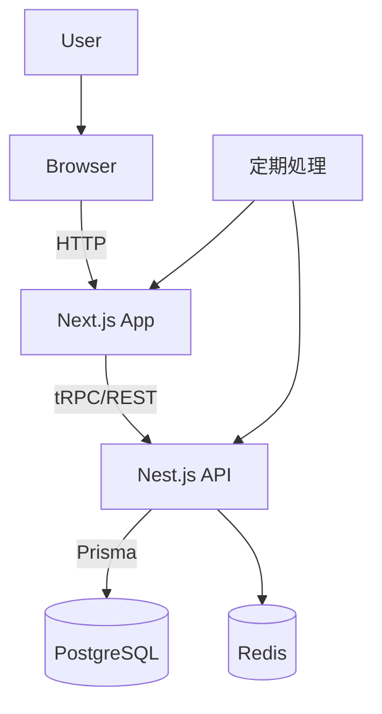

# 技術ドキュメント

## 1. プロジェクト概要
Cal.com はオープンソースのスケジューリングプラットフォームです。自身のドメインでホストでき、見た目やデータ管理を自由にカスタマイズできます。Next.js ベースの Web アプリと API を中心に、プラグイン可能な機能や外部サービス連携を提供します。

### 主な特徴
- イベントタイプ管理、ユーザー・チーム機能、ウェブフックや支払い機能など豊富なスケジューリング機能
- オープンソース (AGPLv3) を中心としたライセンス体系で、企業向け機能は別途商用ライセンス
- プラグイン形式のアプリストアや UI コンポーネント(Atoms)で拡張性を確保

## 2. 技術スタック
以下の言語・フレームワーク・インフラを採用しています。

### フロントエンド
- **Next.js** / **React** / **TypeScript**
- **tRPC** を用いた型安全な API 呼び出し
- **Tailwind CSS** によるスタイリング

### バックエンド
- **API v1**: Next.js API Routes + Zod バリデーション  
- **API v2**: Nest.js ベース
- **Prisma** により **PostgreSQL** データベースを操作
- 一部で **Redis** を利用（レート制限等）
- **Cron** ジョブは `/apps/web/pages/api/cron` 配下に配置

### インフラ
- **Docker** (infra/docker) でコンテナ化
- Turborepo による monorepo 管理

## 3. システムアーキテクチャ
以下は主なコンポーネントの関連図です。



### ディレクトリ構成（抜粋）
```
apps/
├─ web/          # Next.js フロントエンド
├─ api/          # API (v1・v2)
├─ swagger/      # API ドキュメント
└─ ui-playground # UI 開発用

packages/
├─ features/     # 機能別モジュール
├─ platform/     # プラットフォーム共通ライブラリ
├─ prisma/       # DB スキーマ
└─ その他（emails, embeds など）
```

## 4. データフロー
予約作成時の処理例を下記に示します

1. クライアントが `/router?formId=...` にアクセス  
   - 入力値を検証し、ルーティングロジックに基づき適切なイベントタイプへリダイレクト
   - 対象チームメンバーを抽出し、`routedTeamMemberIds` をクエリに追加
   - 通知メールや Webhook を発火
2. ブッキングページで空きスロットを表示
3. スロット選択時に一時的にブロック
4. 予約確定時にメンバーの空き状況を再確認し、メール・Webhook 送信

## 5. セットアップ・運用について
セットアップ手順の概要は以下の通りです。

1. リポジトリをクローンし `yarn` で依存関係をインストール
2. `.env.example` を複製して `.env` を作成し、`NEXTAUTH_SECRET` などを設定
3. 必要に応じ `yarn workspace @calcom/api-v2 build && start` で API v2 を起動
4. Cron ジョブが必要な機能は `/apps/web/pages/api/cron` 配下を参照
5. Node.js 18 を推奨し、PostgreSQL・Prisma を利用

運用面では、Vercel やその他プラットフォーム上で環境変数を適切に設定すること、データベースのマイグレーションを忘れないことが重要です。

## 6. 今後の展望や課題
README では開発ロードマップが公開されており、今後も機能追加や改善が予定されています。プラットフォーム機能の拡充や API の拡張が引き続き課題となるでしょう。また、オープンソース部分と商用機能の切り分けを保ちつつ、コミュニティへの貢献を促す体制づくりが求められます。

---

以上が Cal.com プロジェクトの概要とアーキテクチャの要点です。
